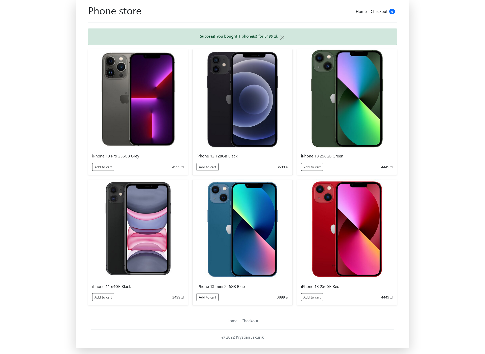
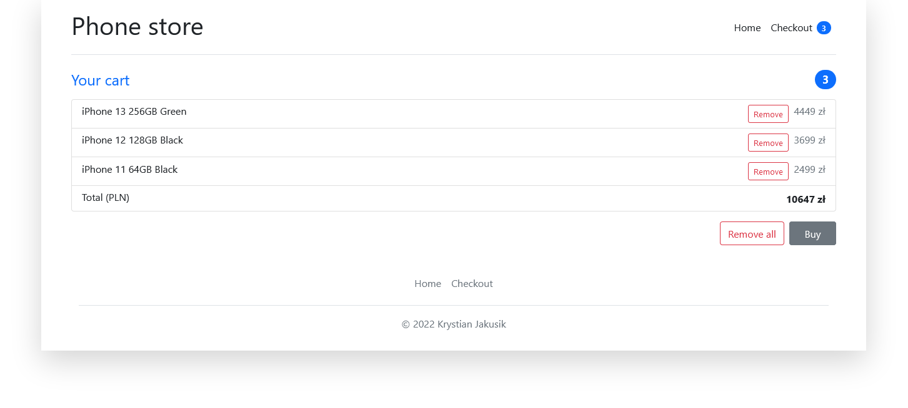

# Node.js Phone Shop

A simple phone shop made with Node.js, Express.js, EJS and Bootstrap. The app is deployed to [fly.io](https://fly.io/) and is available at [https://phone-shop.fly.dev/](https://phone-shop.fly.dev/). It uses MongoDB Atlas as a database and sessions to store the cart.

## Appearance

### Home page

### Checkout

## Setup

### `npm install`

## Running
### `npm start`

Open [http://localhost:3000](http://localhost:3000) to view it in your browser.

### `npm run dev`

Runs the app in the development mode.\
Open [http://localhost:3000](http://localhost:3000) to view it in your browser.

The page will reload when you make changes.\
You may also see any lint errors in the console.

## Areas to improve

- [x] add quantity (there is only one phone per model at the moment)
- [ ] add more phones
- [ ] fix alerts to always appear immediately (sometimes they appear only after a refresh)
- [ ] fix alerts bug (sometimes the message is not displayed)
- [ ] add sorting and filtering
- [ ] add payment form and payment processing
- [ ] add user authentication and authorization
- [ ] add admin panel
- [ ] remove refreshing the page when adding a phone to the cart
